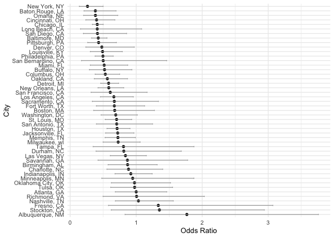
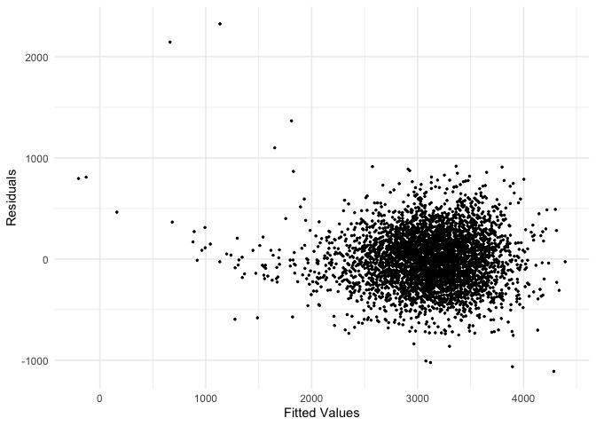
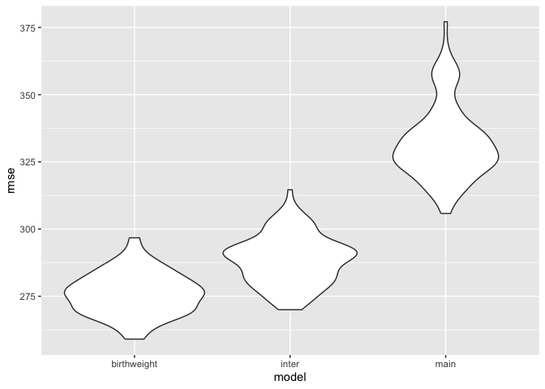

p8105_hw6_xw2961
================

# Problem 2

**Step 1: Import and load dataset**

``` r
url = "https://raw.githubusercontent.com/washingtonpost/data-homicides/master/homicide-data.csv"

homicide_data = read_csv(url)
```

    ## Rows: 52179 Columns: 12
    ## ── Column specification ────────────────────────────────────────────────────────
    ## Delimiter: ","
    ## chr (9): uid, victim_last, victim_first, victim_race, victim_age, victim_sex...
    ## dbl (3): reported_date, lat, lon
    ## 
    ## ℹ Use `spec()` to retrieve the full column specification for this data.
    ## ℹ Specify the column types or set `show_col_types = FALSE` to quiet this message.

**Step 2: Data Preparation**

Create and define `city_state` &
`solved_homicide, filter`victim_race`, and verify`victim_age\`:

``` r
filtered_data <- homicide_data |> 
  mutate(
    city_state = paste(city, state, sep = ", "),
    victim_age = as.numeric(victim_age),
    solved_homicide = ifelse (disposition == "Closed by arrest", 1, 0)
  ) |> 
  filter(
    victim_race %in% c("White", "Black"),
    !city_state %in% c("Dallas, TX", "Phoenix, AZ", "Kansas City, MO", "Tulsa, AL")
  )
```

    ## Warning: There was 1 warning in `mutate()`.
    ## ℹ In argument: `victim_age = as.numeric(victim_age)`.
    ## Caused by warning:
    ## ! NAs introduced by coercion

- Solved is defined as those **with arrests**

**Step 3: Regression - Resolved vs. age, sex, and race \[Baltimore,
MD\]**

``` r
baltimore <- filtered_data |> 
  filter(city_state == "Baltimore, MD")

baltimore_model <- glm(
  solved_homicide ~ victim_age + victim_sex + victim_race,
  data = baltimore,
  family = binomial
)
```

Results: Odd Ratio & CI

``` r
baltimore_results <- 
  broom::tidy(baltimore_model,conf.int = TRUE, conf.level = 0.95) |> 
  mutate(
    OR = exp(estimate),
    lower_CI = exp(estimate - 1.96 * std.error),
    upper_CI = exp(estimate + 1.96 * std.error)
  ) |> 
  filter(term == "victim_sexMale") |> 
  select(OR, lower_CI, upper_CI)

baltimore_results |> knitr::kable(digits = 3)
```

|    OR | lower_CI | upper_CI |
|------:|---------:|---------:|
| 0.426 |    0.325 |    0.558 |

**Step 4: Regression - Resolved vs. age, sex, and race \[Each City\]**

``` r
cities_results <- 
  filtered_data |> 
  group_by(city_state) |> 
  nest() |> 
  mutate(
    model = map(data, ~ glm(solved_homicide ~ victim_age + victim_sex + victim_race, 
                            data = ., family = binomial)),
    tidy_model = map(model, ~broom::tidy(.x, conf.int = TRUE, conf.level = 0.95))
  ) |> 
  unnest(tidy_model) |> 
  mutate(
    OR = exp(estimate),
    lower_CI = exp(estimate - 1.96 * std.error),
    upper_CI = exp(estimate + 1.96 * std.error)
  ) |> 
  filter(term == "victim_sexMale") |> 
  select(city_state, OR, lower_CI, upper_CI)
```

    ## Warning: There were 44 warnings in `mutate()`.
    ## The first warning was:
    ## ℹ In argument: `tidy_model = map(model, ~broom::tidy(.x, conf.int = TRUE,
    ##   conf.level = 0.95))`.
    ## ℹ In group 1: `city_state = "Albuquerque, NM"`.
    ## Caused by warning:
    ## ! glm.fit: fitted probabilities numerically 0 or 1 occurred
    ## ℹ Run `dplyr::last_dplyr_warnings()` to see the 43 remaining warnings.

``` r
cities_results |> knitr::kable(digits = 3)
```

| city_state         |    OR | lower_CI | upper_CI |
|:-------------------|------:|---------:|---------:|
| Albuquerque, NM    | 1.767 |    0.831 |    3.761 |
| Atlanta, GA        | 1.000 |    0.684 |    1.463 |
| Baltimore, MD      | 0.426 |    0.325 |    0.558 |
| Baton Rouge, LA    | 0.381 |    0.209 |    0.695 |
| Birmingham, AL     | 0.870 |    0.574 |    1.318 |
| Boston, MA         | 0.674 |    0.356 |    1.276 |
| Buffalo, NY        | 0.521 |    0.290 |    0.935 |
| Charlotte, NC      | 0.884 |    0.557 |    1.403 |
| Chicago, IL        | 0.410 |    0.336 |    0.501 |
| Cincinnati, OH     | 0.400 |    0.236 |    0.677 |
| Columbus, OH       | 0.532 |    0.378 |    0.750 |
| Denver, CO         | 0.479 |    0.236 |    0.971 |
| Detroit, MI        | 0.582 |    0.462 |    0.734 |
| Durham, NC         | 0.812 |    0.392 |    1.683 |
| Fort Worth, TX     | 0.669 |    0.397 |    1.127 |
| Fresno, CA         | 1.335 |    0.580 |    3.071 |
| Houston, TX        | 0.711 |    0.558 |    0.907 |
| Indianapolis, IN   | 0.919 |    0.679 |    1.242 |
| Jacksonville, FL   | 0.720 |    0.537 |    0.966 |
| Las Vegas, NV      | 0.837 |    0.608 |    1.154 |
| Long Beach, CA     | 0.410 |    0.156 |    1.082 |
| Los Angeles, CA    | 0.662 |    0.458 |    0.956 |
| Louisville, KY     | 0.491 |    0.305 |    0.790 |
| Memphis, TN        | 0.723 |    0.529 |    0.988 |
| Miami, FL          | 0.515 |    0.304 |    0.872 |
| Milwaukee, wI      | 0.727 |    0.499 |    1.060 |
| Minneapolis, MN    | 0.947 |    0.478 |    1.875 |
| Nashville, TN      | 1.034 |    0.685 |    1.562 |
| New Orleans, LA    | 0.585 |    0.422 |    0.811 |
| New York, NY       | 0.262 |    0.138 |    0.499 |
| Oakland, CA        | 0.563 |    0.365 |    0.868 |
| Oklahoma City, OK  | 0.974 |    0.624 |    1.520 |
| Omaha, NE          | 0.382 |    0.203 |    0.721 |
| Philadelphia, PA   | 0.496 |    0.378 |    0.652 |
| Pittsburgh, PA     | 0.431 |    0.265 |    0.700 |
| Richmond, VA       | 1.006 |    0.498 |    2.033 |
| San Antonio, TX    | 0.705 |    0.398 |    1.249 |
| Sacramento, CA     | 0.669 |    0.335 |    1.337 |
| Savannah, GA       | 0.867 |    0.422 |    1.780 |
| San Bernardino, CA | 0.500 |    0.171 |    1.462 |
| San Diego, CA      | 0.413 |    0.200 |    0.855 |
| San Francisco, CA  | 0.608 |    0.317 |    1.165 |
| St. Louis, MO      | 0.703 |    0.530 |    0.932 |
| Stockton, CA       | 1.352 |    0.621 |    2.942 |
| Tampa, FL          | 0.808 |    0.348 |    1.876 |
| Tulsa, OK          | 0.976 |    0.614 |    1.552 |
| Washington, DC     | 0.690 |    0.468 |    1.017 |

**Step 5: Plot ORs & CIs for each City**

``` r
cities_results |>
  ggplot(aes(x = reorder(city_state,desc(OR)), y = OR)) +
  geom_point() +
  geom_errorbar(aes(ymin = lower_CI, ymax = upper_CI), width = 0.25, color = "darkgray") +
  labs(
    x = "City",
    y = "Odds Ratio"
  ) +
  coord_flip() +
  theme_minimal()
```

<!-- --> \*
Of the cities, New York, NY has the lowest OR estimate, whilst
Albuquerque, NM has the highest estimate. \* 22 of the cities have CIs
that do not contian OR = 1.

# Problem 3

**Step 1: Import and load dataset**

``` r
birthweight_data <- 
  read_csv("birthweight.csv") |>
  janitor::clean_names() |>
  mutate(
    babysex = factor(babysex, levels = c(1, 2), 
                     labels = c("Male", "Female")),
    malform = factor(malform, levels = c(0, 1), 
                     labels = c("Absent", "Present")),
    frace = factor(frace, levels = c(1, 2, 3, 4, 8, 9), 
                   labels = c("White", "Black", "Asian", "Puerto Rican", "Other", "Unknown")),
    mrace = factor(mrace, levels = c(1, 2, 3, 4, 8), 
                   labels = c("White", "Black", "Asian", "Puerto Rican", "Other"))
  )
```

    ## Rows: 4342 Columns: 20
    ## ── Column specification ────────────────────────────────────────────────────────
    ## Delimiter: ","
    ## dbl (20): babysex, bhead, blength, bwt, delwt, fincome, frace, gaweeks, malf...
    ## 
    ## ℹ Use `spec()` to retrieve the full column specification for this data.
    ## ℹ Specify the column types or set `show_col_types = FALSE` to quiet this message.

``` r
summary(birthweight_data)
```

    ##    babysex         bhead          blength           bwt           delwt      
    ##  Male  :2230   Min.   :21.00   Min.   :20.00   Min.   : 595   Min.   : 86.0  
    ##  Female:2112   1st Qu.:33.00   1st Qu.:48.00   1st Qu.:2807   1st Qu.:131.0  
    ##                Median :34.00   Median :50.00   Median :3132   Median :143.0  
    ##                Mean   :33.65   Mean   :49.75   Mean   :3114   Mean   :145.6  
    ##                3rd Qu.:35.00   3rd Qu.:51.00   3rd Qu.:3459   3rd Qu.:157.0  
    ##                Max.   :41.00   Max.   :63.00   Max.   :4791   Max.   :334.0  
    ##     fincome               frace         gaweeks         malform    
    ##  Min.   : 0.00   White       :2123   Min.   :17.70   Absent :4327  
    ##  1st Qu.:25.00   Black       :1911   1st Qu.:38.30   Present:  15  
    ##  Median :35.00   Asian       :  46   Median :39.90                 
    ##  Mean   :44.11   Puerto Rican: 248   Mean   :39.43                 
    ##  3rd Qu.:65.00   Other       :  14   3rd Qu.:41.10                 
    ##  Max.   :96.00   Unknown     :   0   Max.   :51.30                 
    ##     menarche        mheight          momage              mrace     
    ##  Min.   : 0.00   Min.   :48.00   Min.   :12.0   White       :2147  
    ##  1st Qu.:12.00   1st Qu.:62.00   1st Qu.:18.0   Black       :1909  
    ##  Median :12.00   Median :63.00   Median :20.0   Asian       :  43  
    ##  Mean   :12.51   Mean   :63.49   Mean   :20.3   Puerto Rican: 243  
    ##  3rd Qu.:13.00   3rd Qu.:65.00   3rd Qu.:22.0   Other       :   0  
    ##  Max.   :19.00   Max.   :77.00   Max.   :44.0                      
    ##      parity            pnumlbw     pnumsga      ppbmi            ppwt      
    ##  Min.   :0.000000   Min.   :0   Min.   :0   Min.   :13.07   Min.   : 70.0  
    ##  1st Qu.:0.000000   1st Qu.:0   1st Qu.:0   1st Qu.:19.53   1st Qu.:110.0  
    ##  Median :0.000000   Median :0   Median :0   Median :21.03   Median :120.0  
    ##  Mean   :0.002303   Mean   :0   Mean   :0   Mean   :21.57   Mean   :123.5  
    ##  3rd Qu.:0.000000   3rd Qu.:0   3rd Qu.:0   3rd Qu.:22.91   3rd Qu.:134.0  
    ##  Max.   :6.000000   Max.   :0   Max.   :0   Max.   :46.10   Max.   :287.0  
    ##      smoken           wtgain      
    ##  Min.   : 0.000   Min.   :-46.00  
    ##  1st Qu.: 0.000   1st Qu.: 15.00  
    ##  Median : 0.000   Median : 22.00  
    ##  Mean   : 4.145   Mean   : 22.08  
    ##  3rd Qu.: 5.000   3rd Qu.: 28.00  
    ##  Max.   :60.000   Max.   : 89.00

\*\* Step 2: Regression Model

- Variables selected: bhead, blength, delwt, fincome, frace, gaweeks,
  malform, menarche, mheight, momage, mrace, pnumlbw, ppbmi, wtgain,
  smoken

- Measures of Child Growth: bhead, blength, gaweeks, malform

- Maternal Health: delwt, menarche, mheight, momage, wtgain, ppbmi,
  pnumlbw, smoken

- SES factors: fincome, frace, mrace

- *All variables are separated into subsets of which hypothesize the
  underlying structure of child birthweight. Measures of child growth
  show the health and size of the child which may predict birthweight
  well. Measures of maternal health indirectly show the health and size
  of child aswhich may predict birthweight. SES factors may potentially
  play a role in predicting birthweight through indirect influence on
  the baby and child’s growth and/or directly on birthweight. *

``` r
birthweight_model <-
  lm(
  bwt ~ bhead + blength + delwt + fincome + frace + gaweeks + malform+ menarche + mheight + momage + mrace + pnumlbw + ppbmi +wtgain + smoken, data = birthweight_data
  )
```

**Step 2: Plot residuals vs. fitted**

``` r
birthweight_plot <-
  birthweight_data |> 
  modelr::add_predictions(birthweight_model) |>
  modelr::add_residuals(birthweight_model)
  
birthweight_plot |>
  ggplot(aes(x = pred, y = resid)) +
  geom_point(size = 0.5) +
  labs(
    x = "Fitted Values",
    y = "Residuals"
  ) +
  theme_minimal()
```

<!-- --> \*
For the comparison, upon deeper inspection: malform, pnumlbw, and smoken
were removed due to zero variance and/or extreme values.

**Step 3: Compare Model**

``` r
cv_results <-
  crossv_mc(birthweight_data, 100) |>
  mutate(
    train = map(train, as_tibble),
    test = map(test, as_tibble),
    birthweight_model = map(train, ~ lm(bwt ~ bhead + blength + delwt + fincome + frace + gaweeks + menarche + mheight + momage + mrace + ppbmi + wtgain, data = .)),
    model_main= map(train, ~ lm(bwt ~ blength + gaweeks, data = .)),
    model_inter = map(train, ~ lm(bwt ~ bhead * blength * babysex, data = .))
  ) |>
  mutate(
    rmse_birthweight = map2_dbl(birthweight_model, test,~ rmse(.x, .y)),
    rmse_main = map2_dbl(model_main, test, ~ rmse(.x, .y)),
    rmse_inter = map2_dbl(model_inter, test, ~ rmse(.x, .y))
  )
```

**Step 4: Plot Models**

``` r
cv_results |>
  select(starts_with("rmse")) |>
  pivot_longer(
    everything(),
    names_to = "model",
    values_to = "rmse",
    names_prefix = "rmse_"
  ) |>
  ggplot(aes(x = model, y = rmse)) +
  geom_violin()
```

<!-- -->

`birthweight`, the model proposed, compared to intersectional and main
effects models, seems to have the lower central tendencies in RMSE
meaning that it seemingly fits the data better than `inter` and `main`.
The intersectional proposal of `birthweight` including biological and
sociological factors that contribute to birthweight may contribute to
its better fit.
